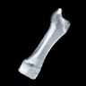
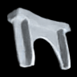

# Deep Learning Challenge 2021

Code of a Denoising Auto-Encoder which won the [Deep Learning Challenge 2021](https://www.kaggle.com/c/uni-tuebingen-deep-learning-2021) at the University Tübingen.

The data and the trained model are too large for GitHub. Feel free to contact us, in case of interest.

### References:

[1] Diederik P Kingma, & Max Welling. (2014). Auto-Encoding Variational Bayes. ([Link](https://arxiv.org/abs/1312.6114))

[2] Irina Higgins, Loic Matthey, Arka Pal, Christopher P. Burgess, Xavier Glorot, Matthew M. Botvinick, Shakir Mohamed, & Alexander Lerchner (2017). beta-VAE: Learning Basic Visual Concepts with a Constrained Variational Framework. In ICLR. ([Link](https://openreview.net/forum?id=Sy2fzU9gl))

[3] Olaf Ronneberger and Philipp Fischer and Thomas Brox (2015). U-Net: Convolutional Networks for Biomedical Image Segmentation. CoRR, abs/1505.04597. ([Link](https://arxiv.org/abs/1505.04597))

