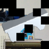
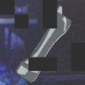

# Deep Learning Challenge 2021

Code of a Denoising Auto-Encoder which won the [Deep Learning Challenge 2021](https://www.kaggle.com/c/uni-tuebingen-deep-learning-2021) at the University Tübingen.

